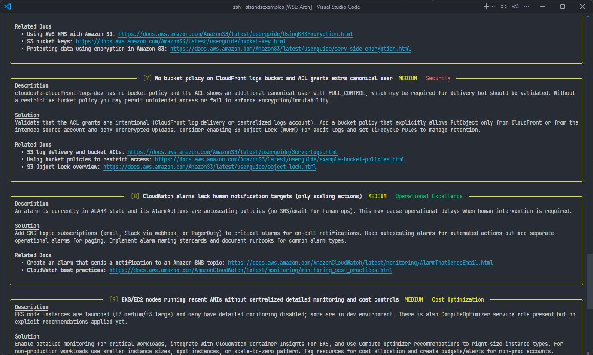

# AWS Well-Architected Audit Agent

An autonomous AI agent that audits an AWS account against the [AWS Well-Architected Framework](https://aws.amazon.com/architecture/well-architected/) and renders findings in a colour-coded terminal report — with interactive follow-up and PDF export.



## How it works

1. The agent connects to AWS via the [AWS MCP proxy](https://aws-mcp.us-east-1.api.aws/mcp) using the Model Context Protocol (MCP).
2. It autonomously inspects IAM, GuardDuty, CloudTrail, Config, S3, EC2, and other services.
3. Findings are returned as structured Pydantic objects, organised across the six Well-Architected pillars.
4. A `rich`-based TUI renders a summary dashboard, findings index, and detailed panels — all colour-coded by severity.
5. After the initial audit, an interactive prompt lets you request additional checks or export a PDF report.

### Well-Architected pillars covered

| Pillar                 | Colour  |
| ---------------------- | ------- |
| Security               | Red     |
| Reliability            | Blue    |
| Operational Excellence | Green   |
| Performance Efficiency | Magenta |
| Cost Optimization      | Yellow  |
| Sustainability         | Cyan    |

### Severity levels

`CRITICAL` > `HIGH` > `MEDIUM` > `LOW` > `OPTIONAL`

## Prerequisites

- Python 3.14+
- [`uv`](https://docs.astral.sh/uv/) package manager
- AWS credentials configured (environment variables, `~/.aws/credentials`, or IAM role)
- OpenAI API key

The AWS principal needs at minimum read-only access. The `SecurityAudit` managed policy provides appropriate coverage.

## Installation

```bash
uv sync
```

## Configuration

```bash
export OPENAI_API_KEY="sk-..."

# AWS credentials (choose one method)
export AWS_ACCESS_KEY_ID="..."
export AWS_SECRET_ACCESS_KEY="..."
export AWS_SESSION_TOKEN="..."      # if using temporary credentials

# or configure a named profile
export AWS_PROFILE="my-audit-role"
export AWS_REGION="us-east-1"       # region for the MCP proxy
```

## Usage

```bash
uv run main.py
```

The agent runs a full audit autonomously. When it finishes, an interactive prompt appears for follow-up requests.

## Output

### Terminal report

**1. Summary dashboard** — two tables side by side: findings by severity and findings by pillar.

**2. Findings index** — all findings sorted from CRITICAL to LOW, with colour-coded severity and pillar columns.

**3. Detailed panels** — one panel per finding, border colour matching its severity, containing:

- Description
- Remediation steps
- **Affected resources** — each resource listed with its type (e.g. `IAM User`, `S3 Bucket`) and identifier (ARN, name, or ID)
- Links to relevant AWS documentation

### Interactive mode

After the initial audit, a prompt accepts further requests. The agent retains full conversation context across turns, so follow-up checks build on what was already discovered.

```
> audit my Lambda function permissions
> check RDS encryption settings
> pdf                          # export all findings to a timestamped PDF
> pdf q1-audit                 # export to q1-audit.pdf
> exit
```

Commands:

| Input | Action |
| --- | --- |
| Any natural-language request | Runs an additional check and displays new findings |
| `pdf` | Saves all session findings to `aws_audit_<timestamp>.pdf` |
| `pdf <filename>` | Saves to the specified file (`.pdf` appended if omitted) |
| `exit` / `quit` / `q` | Exits the program |

### PDF report

The exported PDF mirrors the terminal report and contains:

1. **Title page** — report title and generation timestamp
2. **Summary** — findings by severity and by pillar
3. **Findings index** — full sortable table with colour-coded severity and pillar
4. **Detailed findings** — one section per finding with Description, Solution, Affected Resources, and clickable Related Docs links

The PDF covers **all findings accumulated across the full session**, not just the last response.

## Project structure

```
main.py          # Agent definition, data models, TUI display, and PDF export
pyproject.toml   # Project metadata and dependencies
uv.lock          # Locked dependency graph
```

## Key dependencies

| Package          | Purpose                                             |
| ---------------- | --------------------------------------------------- |
| `strands-agents` | Agent framework with tool-use and structured output |
| `boto3`          | AWS SDK (used transitively by MCP tools)            |
| `pydantic`       | Structured output models                            |
| `rich`           | Terminal UI rendering                               |
| `reportlab`      | PDF report generation                               |
